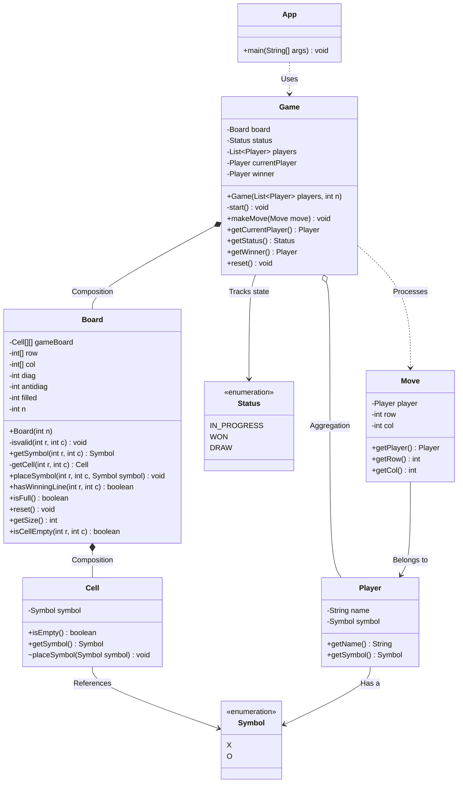

```mermaid
classDiagram
    direction TB

    Board *-- Cell : Composition
    Game o-- Player : Aggregation
    Game *-- Board : Composition
    Game --> Status : Tracks state
    Cell --> Symbol : References
    Player --> Symbol : Has a
    Move --> Player : Belongs to
    Game ..> Move : Processes
    App ..> Game : Uses

    class Symbol {
        <<enumeration>>
        X
        O
    }

    class Status {
        <<enumeration>>
        IN_PROGRESS
        WON
        DRAW
    }

    class Cell {
        -Symbol symbol
        +isEmpty() boolean
        +getSymbol() Symbol
        ~placeSymbol(Symbol symbol) void
    }

    class Board {
        -Cell[][] gameBoard
        -int[] row
        -int[] col
        -int diag
        -int antidiag
        -int filled
        -int n
        +Board(int n)
        -isvalid(int r, int c) void
        +getSymbol(int r, int c) Symbol
        -getCell(int r, int c) Cell
        +placeSymbol(int r, int c, Symbol symbol) void
        +hasWinningLine(int r, int c) boolean
        +isFull() boolean
        +reset() void
        +getSize() int
        +isCellEmpty(int r, int c) boolean
    }

    class Player {
        -String name
        -Symbol symbol
        +getName() String
        +getSymbol() Symbol
    }

    class Move {
        -Player player
        -int row
        -int col
        +getPlayer() Player
        +getRow() int
        +getCol() int
    }

    class Game {
        -Board board
        -Status status
        -List~Player~ players
        -Player currentPlayer
        -Player winner
        +Game(List~Player~ players, int n)
        -start() void
        +makeMove(Move move) void
        +getCurrentPlayer() Player
        +getStatus() Status
        +getWinner() Player
        +reset() void
    }

    class App {
        +main(String[] args) void
    }

    click Symbol href "https://github.com/Varunkonidina/TicTacToe-LowLevelDesign/blob/main/src/Symbol.java" "Open Symbol.java"
    click Status href "https://github.com/Varunkonidina/TicTacToe-LowLevelDesign/blob/main/src/Status.java" "Open Status.java"
    click Cell href "https://github.com/Varunkonidina/TicTacToe-LowLevelDesign/blob/main/src/Board.java" "Open Board.java (inner Cell class)"
    click Board href "https://github.com/Varunkonidina/TicTacToe-LowLevelDesign/blob/main/src/Board.java" "Open Board.java"
    click Move href "https://github.com/Varunkonidina/TicTacToe-LowLevelDesign/blob/main/src/Move.java" "Open Move.java"
    click Player href "https://github.com/Varunkonidina/TicTacToe-LowLevelDesign/blob/main/src/Player.java" "Open Player.java"
    click Game href "https://github.com/Varunkonidina/TicTacToe-LowLevelDesign/blob/main/src/Game.java" "Open Game.java"
    click App href "https://github.com/Varunkonidina/TicTacToe-LowLevelDesign/blob/main/src/App.java" "Open App.java"
```
