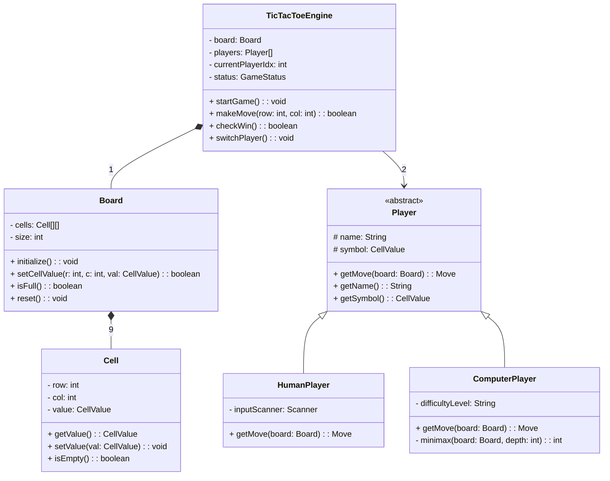

GitHub Package Template
Tic-Tac-Toe Architecture UML
Classes
6
Links
5
Status
Ready

```mermaid
classDiagram
    class TicTacToeEngine{
        - board: Board
        - players: Player[]
        - currentPlayerIdx: int
        - status: GameStatus
        + startGame(): void
        + makeMove(row: int, col: int): boolean
        + checkWin(): boolean
        + switchPlayer(): void
    }
    class Board{
        - cells: Cell[][]
        - size: int
        + initialize(): void
        + setCellValue(r: int, c: int, val: CellValue): boolean
        + isFull(): boolean
        + reset(): void
    }
    class Cell{
        - row: int
        - col: int
        - value: CellValue
        + getValue(): CellValue
        + setValue(val: CellValue): void
        + isEmpty(): boolean
    }
    class Player{
         <<abstract>>
        # name: String
        # symbol: CellValue
        + getMove(board: Board): Move
        + getName(): String
        + getSymbol(): CellValue
    }
    class HumanPlayer{
        - inputScanner: Scanner
        + getMove(board: Board): Move
    }
    class ComputerPlayer{
        - difficultyLevel: String
        + getMove(board: Board): Move
        - minimax(board: Board, depth: int): int
    }
    TicTacToeEngine *-- Board : 1
    TicTacToeEngine --> Player : 2
    Board *-- Cell : 9
    Player <|-- HumanPlayer
    Player <|-- ComputerPlayer
```
